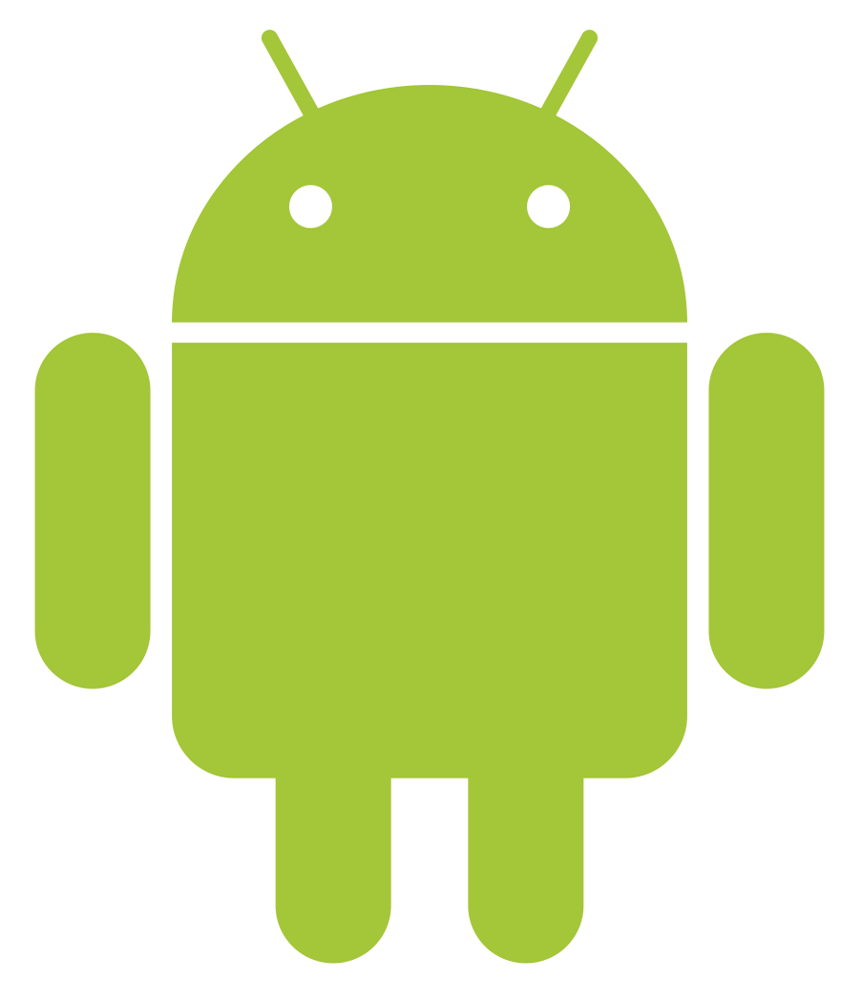
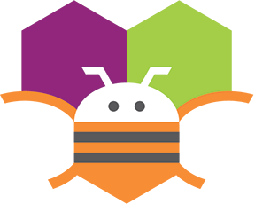
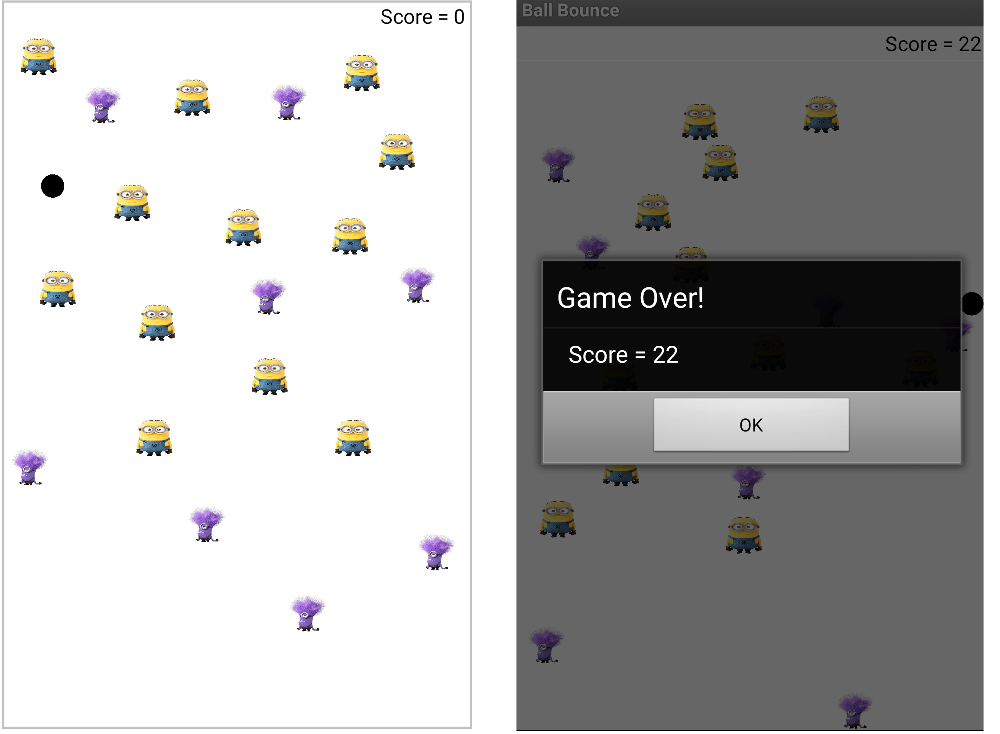
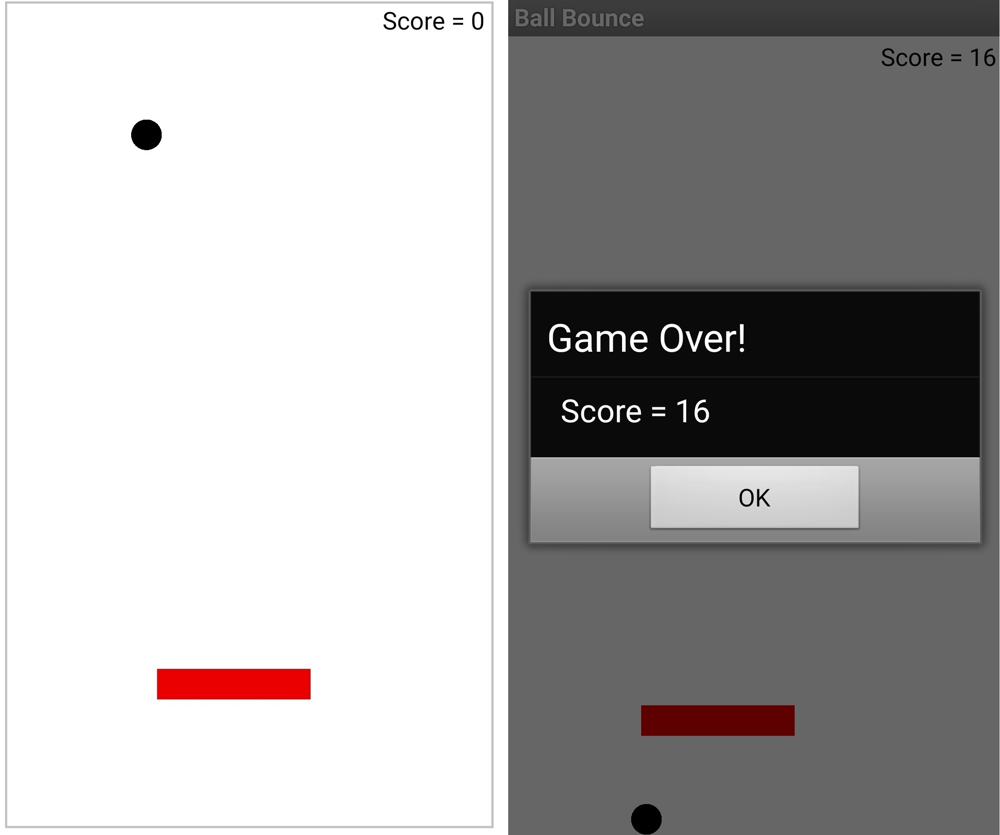
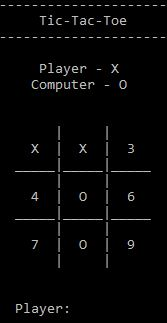

<!-- Reference:
https://github.com/othneildrew/Best-README-Template -->

<!-- PROJECT LOGO -->
 

  <h1><i> Mini-Games </i></h1>

  
  .

  

    Applications for Simple Mini-Games !
  

 

<!-- TABLE OF CONTENTS -->

  
Table of Contents

  <ol>
    <li><a href="#about-the-project">About The Project</a></li>
    <li><a href="#built-with">Built With</a></li>
    <li><a href="#getting-started">Getting Started</a></li>
    <li><a href="#some-screenshots">Some Screenshots</a></li>
    <li><a href="#license-or-author">License or Author</a></li>
    <li><a href="#contact">Contact</a></li>
    <li><a href="#acknowledgments">Acknowledgments</a></li>
  </ol>

 

<!-- ABOUT THE PROJECT -->
## About The Project
  Created applications for simple games like:
  * Ball Bounce (with smart Obstacles Generator)
  * Tic-Tac-Toe (‘v/s Player’ + ‘v/s Computer’)
  * Maze Game (‘Self play’ + ‘Automated - with intelligent Path Decoder’)

  
(<a href="#readme-top">back to top</a>)

## Built With
  &nbsp; &nbsp; &nbsp;  &nbsp; &nbsp; &nbsp; &nbsp; &nbsp; &nbsp;  &nbsp; &nbsp; &nbsp; &nbsp; &nbsp; &nbsp; &nbsp;  &nbsp; &nbsp; &nbsp; &nbsp; &nbsp; &nbsp; &nbsp; &nbsp; 
  
  &nbsp; &nbsp; &nbsp; &nbsp; &nbsp; &nbsp; &nbsp; &nbsp; <b><i> C </i></b> &nbsp; &nbsp; &nbsp; &nbsp; &nbsp; &nbsp; &nbsp; &nbsp; &nbsp; &nbsp; &nbsp; &nbsp; &nbsp; <b><i> C++ </i></b> &nbsp; &nbsp; &nbsp; &nbsp; &nbsp; &nbsp; &nbsp; &nbsp; &nbsp; &nbsp; &nbsp; &nbsp; <b><i> Android </i></b> &nbsp; &nbsp; &nbsp; &nbsp; &nbsp; &nbsp;&nbsp; &nbsp; <b><i> MIT App Inventor </i></b>

  
(<a href="#readme-top">back to top</a>)

<!-- GETTING STARTED -->
## Getting Started
  #### Prerequisites
  * C, C++
  * Android, MIT App Inventor
  * IDE - Codeblocks (Preferred), VS Code
  * Machine Requirements: Minimum 4GB RAM, Intel i5 Processor (or Equivalent)
  
  #### Setup and Use
  1. ###### Ball Bounce
       1. Get the your source code of application of your choice from <b>'/1 - Ball Bounce Games (2 Types) - For Android/'</b>
       2. Open/Import the source folder in MIT App Inventor.
       3. Build the apks and use them on your Android Devices.
          (<b>Note: </b> Alternatively,  executables (apks) for each version can be found in their respective folder.)

  2. ###### Tic-Tac-Toe
       1. Get the source code of the application of your choice from <b>'/2 - Tic-Tac-Toe Game - using C++/'</b>.
       2. Open/Import the source folder in IDE.
       3. Build the apks and use them on your machines.
          (<b>Note: </b> Alternatively,  executables for each version can be found in their respective folder.)

  3. ###### Maze Game
       1. Get the source code of the application of your choice from <b>'/3 - Simple Maze Game - in C/'</b>.
       2. Open/Import the source folder in IDE.
       3. Build the apks and use them on your machines.
          (<b>Note: </b> Alternatively,  executables for each version can be found in their respective folder.)

  
(<a href="#readme-top">back to top</a>)

  
<!-- SOME SCREENSHOTS -->
## Some Screenshots
  1. ###### Ball Bounce
      
         
      

  2. ###### Tic-Tac-Toe
      

  3. ###### Maze Game
      
  
   
   
(<a href="#readme-top">back to top</a>)

   

<!-- LICENSE -->
## License or Author
  * Uditya Laad, Goa College of Engineering, Goa University, GA, IN

  
(<a href="#readme-top">back to top</a>)

<!-- CONTACT -->
## Contact
  <b>Uditya Laad</b> &nbsp; [@linkedin.com/in/uditya-laad-222680148](https://www.linkedin.com/in/uditya-laad-222680148/)
  
  &nbsp; &nbsp; &nbsp; &nbsp; &nbsp; &nbsp; &nbsp; &nbsp; &nbsp; &nbsp; &nbsp; [@github.com/udityalaad](https://github.com/udityalaad)
  
  &nbsp; &nbsp; &nbsp; &nbsp; &nbsp; &nbsp; &nbsp; &nbsp; &nbsp; &nbsp; &nbsp; udityalaad123@gmail.com

  <b>Project Link</b> &nbsp; [https://github.com/udityalaad/Applications_for_Simple_MiniGames](https://github.com/udityalaad/Applications_for_Simple_MiniGames)

  
(<a href="#readme-top">back to top</a>)

<!-- ACKNOWLEDGMENTS -->
## Acknowledgments
  * [github.com/othneildrew/Best-README-Template/](https://github.com/othneildrew/Best-README-Template)
  
  
(<a href="#readme-top">back to top</a>)

